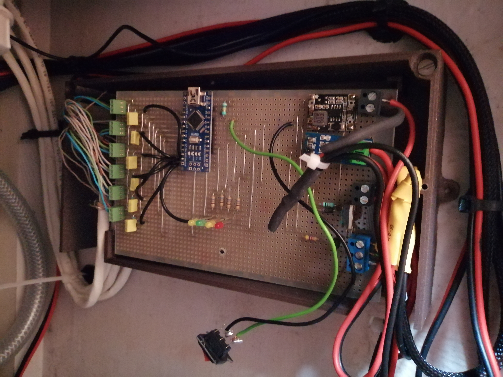

# Fridge_Controller

Arduino program dedicate to control a 12V brushless compressor fridge.

1. Compressor : 12V brushless : [Documentation](Pictures/2020_Doc_Compressor.pdf)
2. Electronics devices for the control board : 
- Temperature sensor : LM35.
- ArduinoNano Board
- Regulateur de tension 5-24V -> 5V
3. Control board : 

# Table of contents

- [Usage](#usage)
- [Installation](#installation)
- [Support](#Support)
- [Project Status](#project)
- [License](#license)

# Usage

[(Back to top)](#table-of-contents)

The programm is divided in severals functions :

## Acquisition_capteurs() : 
This function let the arduino get the values of severals sensors :
- Several Temperature sensor (Compressor, Condensor, SeaWatercooling, inside the fridge, return of evaporator).
- CurrentFlow in A
- Status of one interuptor (0 or 1).
 
 ## Etat_des_Alarmes():  
- Define the status of the device according to sensors values.
- Several level of alarm are defined:
1. Level 1 is the most critical and stops the compressor running until the user turn the device off.
2. Level 2, 3 and 4 are information given to the user by LED blicking.

  ## Force_Tem_SI_init_ou_inter_chg(Temps_Init_TEm):
-  Feature designed to redefine the Sea Temperature, it's called by actionning the interuptor.
  ## Pilotage_Compresseur():
-  Procedure which define if compressor should run or not (according to Alarm status and sensors).
 ## Pilotage_Pompe_eau():
-  Procedure which define if the water pump should run or not, a % of running time is defined according to the  distance between real temperature and temperature to be reach.
  ## Affichage_Led():
- Procedure which define whether the LED has to be turned on or not. 
 ## Sortie_Serie_2():
-  Procedure dedicated to send data trought the serial port of the arduino.

 [See Notice](Pictures/Notice.pdf)	

# Installation

[(Back to top)](#table-of-contents)
  
  Source code developped on C for arduino.

# Project Status
[(Back to top)](#table-of-contents)

Designed and developped during 2021-2022, on personal application.

# License

[(Back to top)](#table-of-contents)
	
